<div align="center">

# DroneAndRooms — Distributed Drone Navigation Simulator

[](https://isocpp.org/)
[](https://www.qt.io/)
[](.)

**M1 IoT · Distributed Algorithms for Programmable Matter**
**Université Marie et Louis Pasteur, Montbéliard · 2024–2025**

[👤 GitHub Profile](https://github.com/AhmedAlmuharaq) · [📄 Project Report](Documents/DronesAndRooms_Report_Ahmed_bolo.pdf)

</div>

---

## Overview

**DroneAndRooms** is a Qt-based simulation of distributed drone navigation across a Voronoi-partitioned environment. Each server owns a room (Voronoi cell); drones autonomously navigate from their starting position to a target server by passing through doors (shared polygon edges) using optimal shortest-path routing.

> Geometry → Graph → Animation: the three-step pipeline that drives the whole simulation.

---

## How It Works

<div align="center">

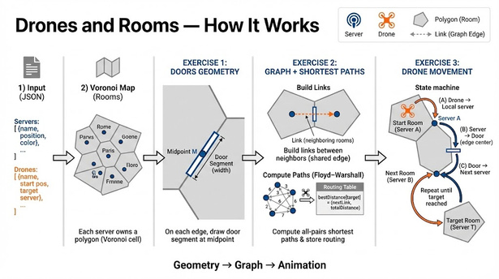

</div>

The simulation runs in three exercises, each building on the previous:

| Step | What happens |
|------|-------------|
| **Load JSON** | Parse servers (name, position, color) and drones (name, start, target server) |
| **Voronoi diagram** | Each server owns a polygon room — the Voronoi cell around it |
| **Exercise 1** | Draw doors at the midpoint of each shared polygon edge |
| **Exercise 2** | Build a graph of neighboring servers and compute all-pairs shortest paths (Floyd-Warshall) |
| **Exercise 3** | Animate each drone following the optimal route: local server → door → next server → … → target |

---

## Step 0 — Load JSON Configuration

<div align="center">

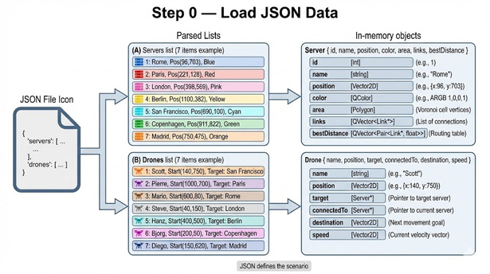

</div>

The scenario is defined in a JSON file with two lists:
- **Servers** — id, name, position, color, Voronoi cell polygon, link list, routing table
- **Drones** — name, start position, target server, current room pointer, destination, speed vector

Three example scenarios are included: `json/simple.json`, `json/arcane.json`, `json/Ahmed.json`.

---

## Step 1 — Voronoi Diagram (Rooms)

<div align="center">

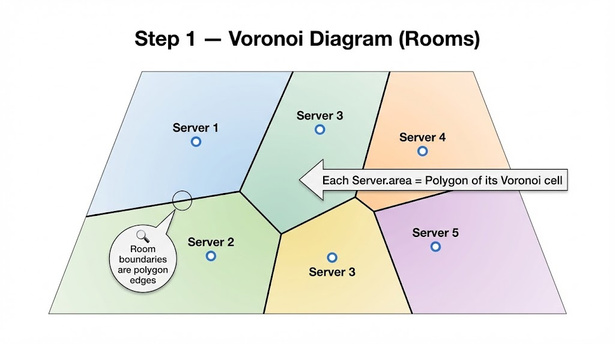

</div>

Each server is assigned a Voronoi cell polygon computed from the server positions. Room boundaries are polygon edges — two rooms are neighbors if they share a common edge.

---

## Exercise 1 — Door Geometry

### Concept

<div align="center">

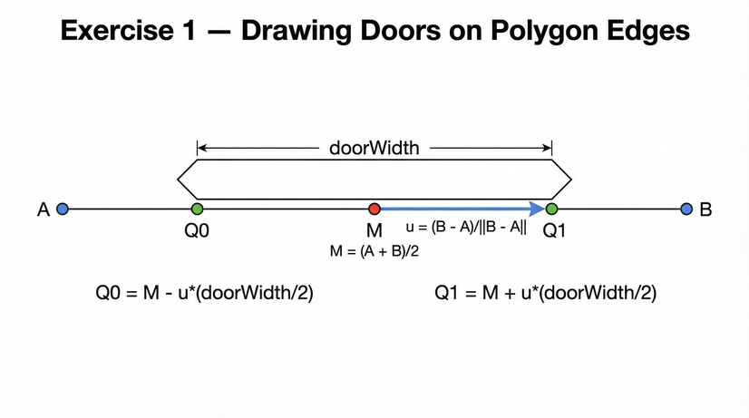

</div>

On every shared edge (A, B), a door segment is drawn centered at the midpoint M:

```
M  = (A + B) / 2
u  = (B - A) / ||B - A||          (unit direction vector)
Q0 = M - u * (doorWidth / 2)
Q1 = M + u * (doorWidth / 2)
```

### Implementation — `Polygon::drawDoors`

<div align="center">

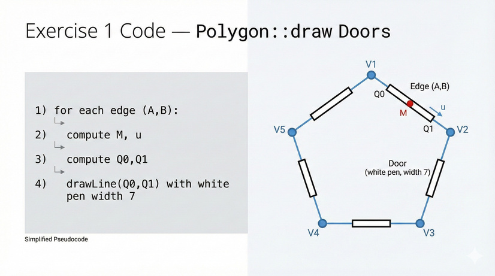

</div>

For each edge, compute M and u, then draw a white line of width 7 from Q0 to Q1 — visually "opening" the wall between two rooms.

---

## Exercise 2 — Server Graph & Shortest Paths

### Building the Graph

<div align="center">

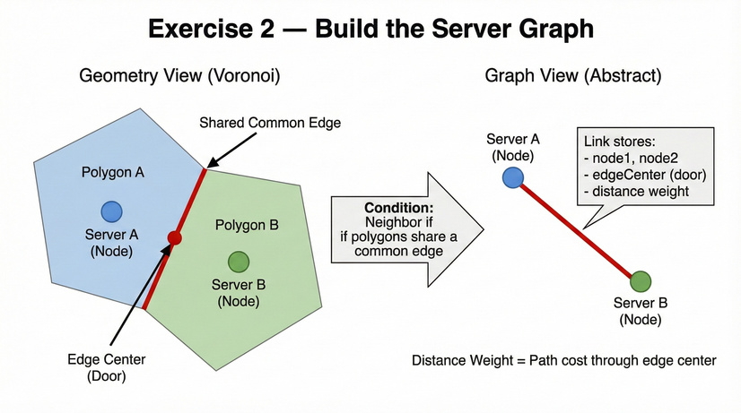

</div>

Two servers are neighbors if their Voronoi polygons share a common edge. Each **Link** stores:
- Pointers to the two servers
- The edge center (used as the door waypoint)
- The distance weight (path cost through the door)

### Neighbor Detection Algorithm

<div align="center">

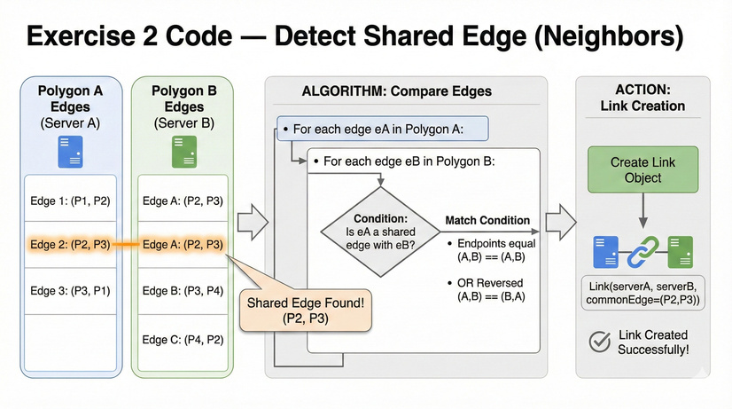

</div>

For every pair of polygons, compare all edge pairs. If two edges share the same endpoints (in any order), a Link is created between those servers.

### Floyd-Warshall All-Pairs Shortest Paths

<div align="center">

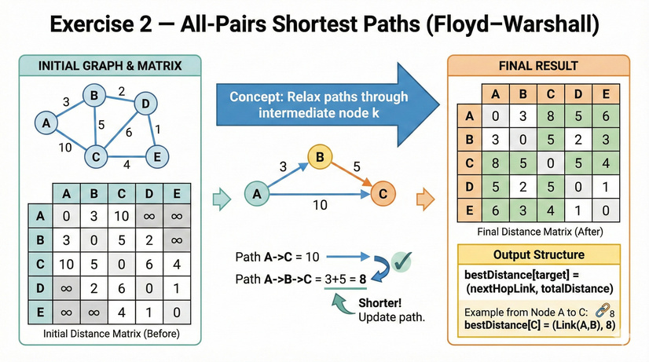

</div>

After building the link graph, Floyd-Warshall computes the optimal path between every pair of servers. The result is stored as a distance matrix relaxed through each intermediate node k.

### Routing Table (`bestDistance`)

<div align="center">

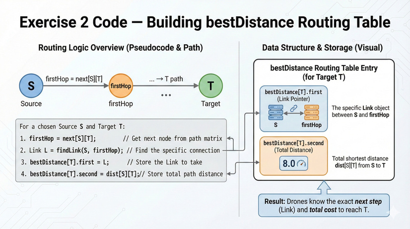

</div>

Each server stores a `bestDistance` routing table: for any target T, it holds the **next Link to take** (`firstHop`) and the **total distance**. Drones query this table to decide their next move at each step.

---

## Exercise 3 — Drone Navigation

### State Machine

<div align="center">

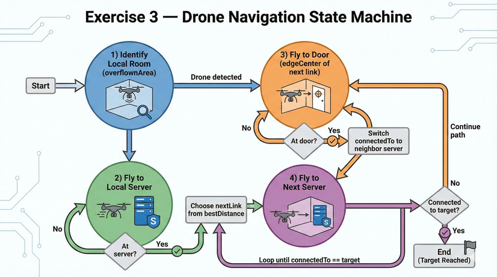

</div>

Each drone runs a 4-state finite automaton:

| State | Action |
|-------|--------|
| **1 — Identify local room** | Find which Voronoi cell the drone is currently inside |
| **2 — Fly to local server** | Move toward the server of the current room |
| **3 — Fly to door** | Move toward the `edgeCenter` of the next link from the routing table |
| **4 — Fly to next server** | Switch `connectedTo` to the neighbor server, repeat until target reached |

### Movement Logic — `Drone::move(dt)`

<div align="center">

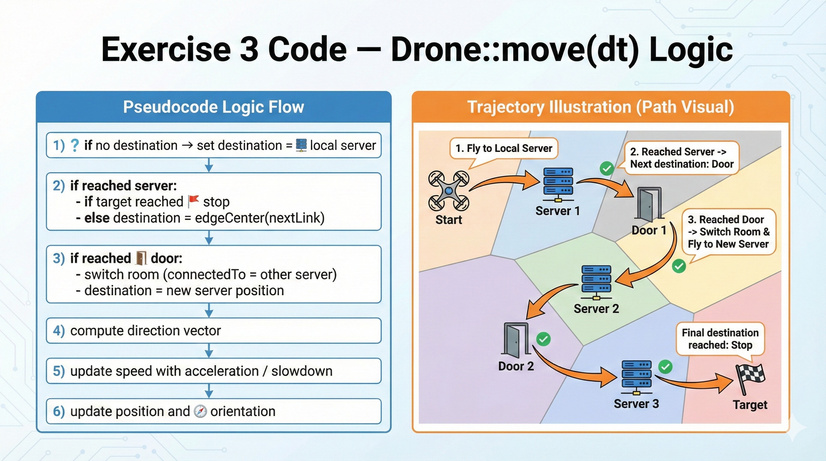

</div>

At every timestep:
1. If no destination → set destination to local server
2. If reached server → check if target; if not, set destination to `edgeCenter` of next link
3. If reached door → switch room (`connectedTo`), set destination to new server position
4. Compute direction vector, update speed with acceleration/slowdown, update position

---

## End-to-End Example

<div align="center">

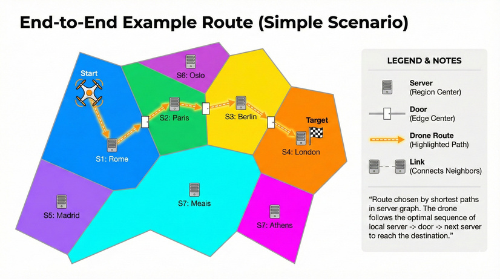

</div>

In the simple scenario (7 European cities), a drone starting in **Rome** navigates to **London** by passing through: Rome → Paris (door) → Berlin (door) → London. The route is chosen by the shortest-path routing table — the drone always takes the optimal next hop.

---

## Project Structure

```
DroneAndRooms/
├── main.cpp                  Entry point — Qt application launch
├── mainwindow.cpp/h          Main window, animation timer, JSON loading
├── canvas.cpp/h              Custom QWidget — drawing & animation loop
├── polygon.cpp/h             Polygon class: Voronoi cells, doors, point-in-poly
├── vector2d.cpp/h            2D vector math (dot, norm, distance, normalize)
├── serveranddrone.cpp/h      Server and Drone entities, Link struct
├── trianglemesh.cpp/h        Delaunay triangulation mesh
├── determinant.cpp/h         Geometric determinant utility
├── json/
│   ├── simple.json           7 servers, 7 drones — tutorial scenario
│   ├── arcane.json           Complex scenario
│   └── Ahmed.json            Custom scenario
├── media/
│   └── drone.png             Drone icon used in canvas rendering
├── images/                   Presentation slides (extracted from PowerPoint)
├── Documents/
│   ├── *.pptx                Project presentation
│   └── *_Report*.pdf         Project report
└── docs/                     Doxygen-generated HTML documentation
```

---

## Tech Stack

| Category | Technology |
|----------|-----------|
| **Language** | C++17 |
| **GUI Framework** | Qt 6 (Widgets, Core) |
| **Compiler** | MinGW 64-bit |
| **Build System** | Qt Creator `.pro` file |
| **Documentation** | Doxygen |
| **Algorithms** | Voronoi, Delaunay triangulation, Floyd-Warshall, finite automaton |

---

## Build & Run

```bash
# Open in Qt Creator
File → Open Project → DronesAndRooms.pro

# Or build from command line
qmake DronesAndRooms.pro
make

# Run
./DronesAndRooms
```

Select a JSON scenario file from `json/` when prompted. The simulation starts automatically.

---

## Authors

<div align="center">

| | Name | Program | Links |
|--|------|---------|-------|
| 👤 | **Ahmed Almuharaq** | M1 IoT | [GitHub](https://github.com/AhmedAlmuharaq) · [LinkedIn](https://www.linkedin.com/in/almuharaqa/) |
| 👤 | **Boluwatife ABIONA** | M1 IoT | Université Marie et Louis Pasteur |

**Institution:** Université Marie et Louis Pasteur, Montbéliard, France
**Year:** 2024–2025

</div>

---

<div align="center">

*Developed for academic purposes as part of the M1 Distributed Algorithms for Programmable Matter curriculum.*

</div>
